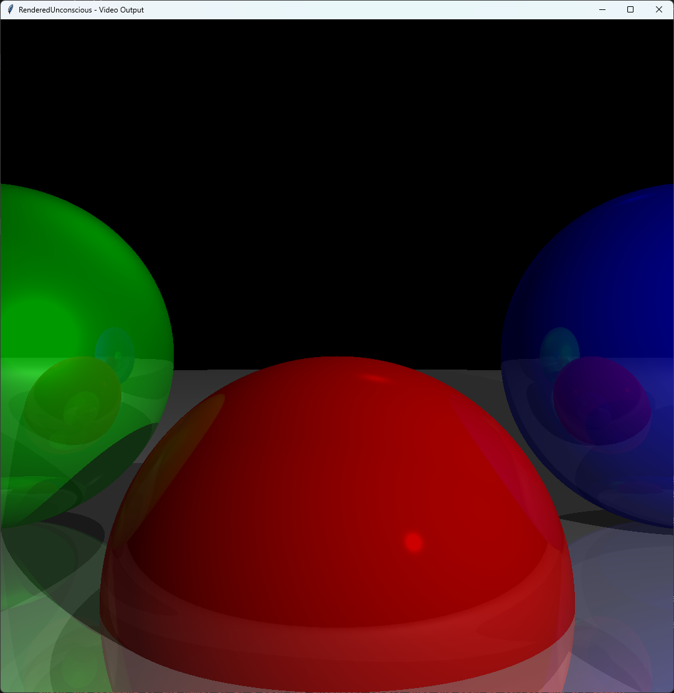

# RenderedUnconscious
> "The key to growth is the introduction of higher dimensions of consciousness into our awareness."
>
> <em>Lao Tzu, Chinese philospher</em>

"Build a 3D engine!" they said. "It'll be fun!" they said. 4 hours of neurosis later, I present the world with this abomination.

Written in Python for maximum ~~ease of understanding~~, sorry - pain. What's worse is that I found it kind of fun. I must complete the journey with a rasteriser soon.

> "Maybe the real treasure was the linear algebra I learnt along the way!"

At least I learnt a lot about how graphics are handled.

## Usage
You likely have better things to do than to try out what seems to be gunning for last place in a ray-tracer speed competition, but if you have no life, you can use it as follows:

First obtain a copy of the repository. You can do so via git (funnily enough, this niche software just so happens to be the basis of GitHub!):

```bash
git clone https://github.com/COHEJH/RenderedUnconscious.git
```

> [!TIP]
> If you are one of the 3 *'developers'* out there without git, please consult [this helpful tutorial](https://www.youtube.com/watch?v=dQw4w9WgXcQ). 

After that, you need to install the requirements (`numpy` and `PIL`). You likely have these preinstalled, but if you don't:

```bash
pip install -r requirements.txt
```

> [!IMPORTANT]
> Please run this in the correct directory... I've had people email me because I failed to state this seemingly obvious fact in previous projects. Change directory with `cd <PATH>`. An error at this stage is **NOT** my fault.
>
> **UPDATE**: If you don't know what `pip` is, please consider an alternate career such as goose farming, nice and far away from the pesky clankers.

At last, the hour of death (for your CPU) draws near! You can run the ray tracer (and maybe when I make it, the rasteriser) like so:

```python
from rayTracer import RayTracer

RayTracer(...)
```

Should anyone really be sadistic enough to watch their CPU suffer, here is some more information regarding parameters.

A `RayTracer` has the following parameters:
- `dimX` (int) - The viewport width (in pixels)
- `dimY` (int) - The viewport height (in pixels)
- `scene` (`Scene` object) - A scene object containing the things to be rendered (spheres and lights)
- `cameraPos` (tuple with 3 numbers) - Camera position (X Y Z), defaulting to 0, 0, 0
- `cameraRot` (tuple with 2 numbers) - Camera rotation (pitch yaw), defaulting to 0, 0. positive pitch is up, positive yaw is to the right.
- `recursionDepth` (int) - The maximum reflections to compute. Defaults to 3.

> [!TIP]
> Larger `dimX` and `dimY` values result in more pixels. Rendering time will therefore increase. Unless you wish to make your CPU endure torture for extended durations (and destroy every last core), I suggest you go with sensible values (i.e. <1e99, thank you very much). 

`Scene` can be found in `primitives` and has 2 paramters:
- `spheres` (list of `Sphere` objects) - Spheres to render. `Sphere` has properties `centre` (tuple with 3 coords), `radius` (int), `colour` (tuple with R G B), `specular` (int, -1 is 0 specularity), `reflectivity` (float, 0 - 1)
- `lights` (list of `Light` objects) - Lights to render, all of which have `intensity` property (float, 0 - 1). The subtypes are `AmbientLight`, `PointLight` (with additional property position as tuple) and `DirectionalLight` (with property direction as tuple).

> [!IMPORTANT]
> Both `Sphere` and the `Light`-based objects can be found in `primitives`. Do not use base `Light` class, but rather the `AmbientLight`, `PointLight` and `DirectionalLight` derivatives.

## Example
Here is a very simple script, to render 4 spheres:

```python
from rayTracer import RayTracer
from primitives import *

scene = Scene([
        Sphere((0, -1, 3), 1, (255, 0, 0), 500, 0.2), 
        Sphere((2, 0, 4), 1, (0, 0, 255), 500, 0.3), 
        Sphere((-2, 0, 4), 1, (0, 255, 0), 10, 0.4), 
        Sphere((0, -5001, 0), 5000, (255, 255, 255), 1000, 0.5)
    ],
    [
        AmbientLight(0.2), 
        PointLight(0.6, (2, 1, 0)), 
        DirectionalLight(0.2, (1, 4, 4))
    ])

RayTracer(1080, 1080, scene)
```

After waiting approximately two eternities and 7 exploded CPU threads later, this **should** show the following:



*Brilliantly sized for your screen, I know. Not like your entire screen has just been filled with this image, right?*

## Licence

This *'project'* is licensed under the unlicense:

```
This is free and unencumbered software released into the public domain.

Anyone is free to copy, modify, publish, use, compile, sell, or
distribute this software, either in source code form or as a compiled
binary, for any purpose, commercial or non-commercial, and by any
means.

In jurisdictions that recognize copyright laws, the author or authors
of this software dedicate any and all copyright interest in the
software to the public domain. We make this dedication for the benefit
of the public at large and to the detriment of our heirs and
successors. We intend this dedication to be an overt act of
relinquishment in perpetuity of all present and future rights to this
software under copyright law.

THE SOFTWARE IS PROVIDED "AS IS", WITHOUT WARRANTY OF ANY KIND,
EXPRESS OR IMPLIED, INCLUDING BUT NOT LIMITED TO THE WARRANTIES OF
MERCHANTABILITY, FITNESS FOR A PARTICULAR PURPOSE AND NONINFRINGEMENT.
IN NO EVENT SHALL THE AUTHORS BE LIABLE FOR ANY CLAIM, DAMAGES OR
OTHER LIABILITY, WHETHER IN AN ACTION OF CONTRACT, TORT OR OTHERWISE,
ARISING FROM, OUT OF OR IN CONNECTION WITH THE SOFTWARE OR THE USE OR
OTHER DEALINGS IN THE SOFTWARE.

For more information, please refer to <https://unlicense.org>
```

Honestly, if anyone actually finds a use for this, I'll be very impressed.